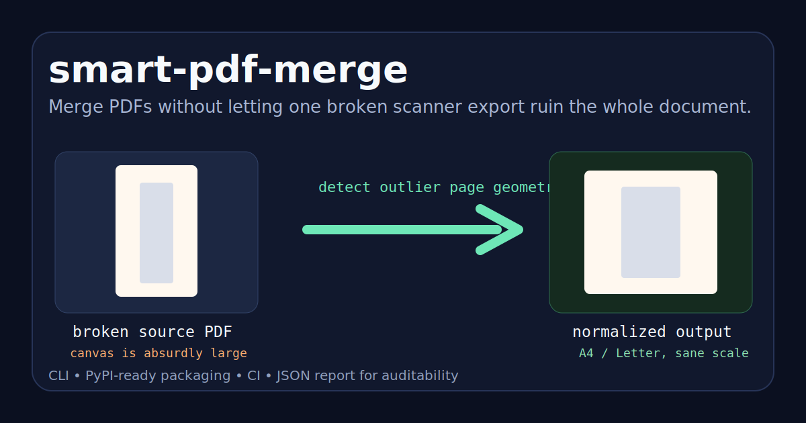

# smart-pdf-merge

[](https://github.com/minanagehsalalma/smart-pdf-merge/actions/workflows/ci.yml)
[](LICENSE)
[](https://www.python.org/)

Merge PDFs without letting one broken scanner export ruin the whole document.

`smart-pdf-merge` is a privacy-safe Python CLI for a specific real-world PDF problem: one input file has absurd page geometry, so the merged result opens with a tiny page, insane zoom, or a visually broken layout.

It does not blindly concatenate files. It inspects every page, detects suspicious outliers, normalizes only the broken ones, and tells you exactly why.



## Why people need this

This shows up constantly in scanned documents:

- an ID scan looks normal by itself but its PDF canvas is physically enormous
- a passport or receipt export opens fine alone but becomes microscopic after merge
- one page from a phone scanner wrecks the scale of an otherwise normal PDF set
- generic merge tools succeed technically while still producing a bad document

`smart-pdf-merge` fixes the page geometry problem at merge time.

## Quick start

Install from GitHub:

```bash
pip install git+https://github.com/minanagehsalalma/smart-pdf-merge.git
```

Merge PDFs in order:

```bash
smart-pdf-merge broken-scan.pdf normal-document.pdf -o merged-fixed.pdf
```

Generate a machine-readable audit report too:

```bash
smart-pdf-merge broken-scan.pdf normal-document.pdf \
  -o merged-fixed.pdf \
  --report-json merge-report.json
```

Example CLI output:

```text
[NORMALIZE] broken-scan.pdf page 1: 11520.0 x 8085.6pt (160.0 x 112.3in) -> 842 x 595pt at scale 0.07012
  reason: max dimension 11520.0pt exceeds 2000.0pt; page area 93146112pt^2 exceeds cohort median 500990pt^2 by factor 185.92
[KEEP] normal-document.pdf page 1: 595.0 x 842.0pt (8.3 x 11.7in)
Wrote /path/to/merged-fixed.pdf with 2 pages. Normalized 1 page(s), kept 1 page(s).
```

## What makes it different

- Detects broken page geometry instead of assuming the inputs are sane.
- Normalizes only suspicious outlier pages by default.
- Preserves already-correct pages unchanged.
- Keeps portrait and landscape output sensible.
- Produces a JSON report for automation and auditability.
- Works well as a terminal tool, scriptable utility, or CI step.

## How it decides a page is suspicious

By default, the CLI marks a page for normalization when either of these is true:

- its maximum dimension is larger than `2000pt`
- its page area is more than `3x` the cohort median area

That combination catches the common “looks fine visually, but the PDF canvas is nonsense” case without rebuilding every page.

## Installation options

From a local clone:

```bash
pip install .
```

Directly with Python:

```bash
python smart_pdf_merge.py input-a.pdf input-b.pdf -o output.pdf
```

Check the version:

```bash
smart-pdf-merge --version
```

## Command reference

```text
usage: smart_pdf_merge.py [-h] -o OUTPUT [--paper {a4,letter}] [--margin MARGIN]
                          [--absolute-max-dimension ABSOLUTE_MAX_DIMENSION]
                          [--relative-area-factor RELATIVE_AREA_FACTOR]
                          [--normalize-all] [--quiet] [--report-json REPORT_JSON]
                          [--version]
                          inputs [inputs ...]
```

Key options:

- `-o, --output`: output PDF path
- `--paper {a4,letter}`: paper size used for normalized pages
- `--margin`: margin in PDF points around normalized content
- `--absolute-max-dimension`: max width or height before a page is suspicious
- `--relative-area-factor`: outlier threshold relative to the input cohort median
- `--normalize-all`: rebuild every page onto a standard canvas
- `--report-json`: write a JSON decision report for downstream tooling
- `--quiet`: print only the final summary

## Good use cases

- Merging scanned identity documents with normal PDFs
- Fixing phone-scanner exports before upload
- Cleaning up mixed-source document packets
- Automating PDF normalization in scripts or ops workflows

## Limitations

- It targets page-geometry problems, not OCR or image enhancement.
- It does not redact sensitive content.
- It assumes the page content itself is visually correct and the canvas is the problem.

## Development

Run the test suite:

```bash
python -m unittest discover -s tests -v
```

Project files worth reading:

- [smart_pdf_merge.py](smart_pdf_merge.py)
- [tests/test_smart_pdf_merge.py](tests/test_smart_pdf_merge.py)
- [CHANGELOG.md](CHANGELOG.md)
- [CONTRIBUTING.md](CONTRIBUTING.md)
- [SECURITY.md](SECURITY.md)

## Privacy note

Do not commit real passports, IDs, permits, invoices, or other sensitive PDFs to the repository. Reproduce bugs with redacted or synthetic samples.

## License

MIT
